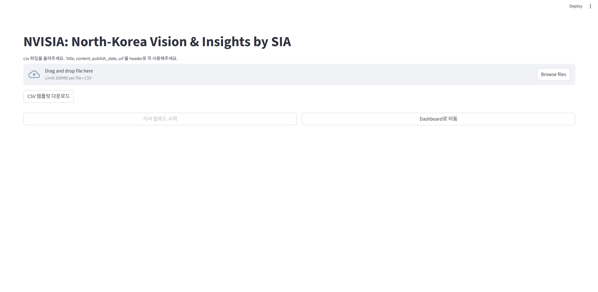
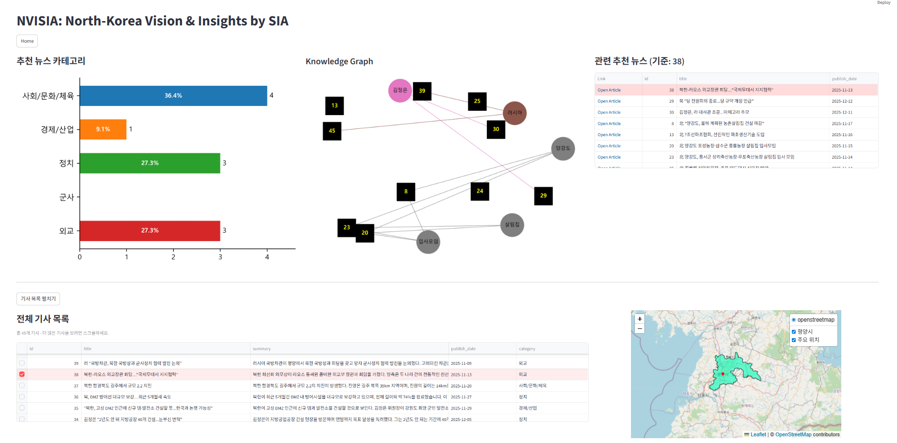

# NVISIA: North Korea Visual Insight with SIA

> **End-to-End AI-Powered News Intelligence Platform for North Korea Analysis**
> **북한 뉴스 분석을 위한 End-to-End AI 인텔리전스 플랫폼**
> Developed as part of the ModuLabs Aiffel Data Scientist Bootcamp
> In collaboration with **SI Analytics** (https://si-analytics.ai/)

---

## Project Overview | 프로젝트 소개  

NVISIA is an end-to-end AI-powered news intelligence platform designed to collect, structure, analyze, and visualize North Korea–related news data using LLMs and machine learning.  

The system processes news datasets through a full pipeline including:  

`Data Ingestion → ETL → LLM Enrichment → ML Classification → Database Storage → Analytics Dashboard`  

It enables researchers, analysts, and policy professionals to explore North Korea–related developments in a structured and interactive way.  


NVISIA는 북한 관련 뉴스를 자동으로 수집하고 구조화하며 분석 및 시각화하는 End-to-End AI 기반 뉴스 인텔리전스 플랫폼입니다.  

이 시스템은 다음과 같은 파이프라인을 통해 뉴스 데이터를 처리합니다:  

`데이터 수집 → ETL → LLM 기반 정보 추출 → 머신러닝 분류 → 데이터베이스 저장 → 분석 대시보드`  

이를 통해 연구자, 정책 분석가, 기업 실무자들이 북한 관련 동향을 보다 구조적으로 탐색할 수 있도록 지원합니다.  

---

## System Interface | 시스템 인터페이스  

### Home Screen 

<p align="center">
  
</p>  

Users upload a CSV file containing news articles. The system then automatically performs:  
`ETL → LLM summarization → keyword extraction → ML classification → database ingestion` 

사용자가 뉴스 기사 데이터가 포함된 CSV 파일을 업로드하면, 다음 작업이 자동으로 수행됩니다.  
`ETL → LLM 기반 기사 요약 → 키워드 추출 → 머신러닝 분류 → 데이터베이스 저장`  

---

### Dashboard

<p align="center">
  
</p>  

The dashboard provides:  
*   News category distribution  
*   Knowledge graph visualization  
*   Recommended articles  
*   Interactive geospatial map  
*   Article browsing and filtering  

대시보드는 다음 기능을 제공하고 있습니다:  
* 뉴스 카테고리 분포 시각화  
* Knowledge Graph 기반 기사 관계 분석  
* 연관 기사 추천 기능  
* 지도 기반 지리 정보 시각화  
* 기사 목록 탐색 및 필터링  

---

## Key Features | 주요 기능  

### **Automated Data Pipeline** 
News crawling and CSV-based ingestion pipeline for automated ETL processing.  
뉴스 크롤링과 CSV 기반 데이터 수집을 통해 자동화된 ETL 파이프라인을 제공합니다.  

* News crawling via BeautifulSoup  
* CSV-based ingestion pipeline  
* Automated ETL processing  


### **LLM-Based Enrichment**  
LLM-based enrichment pipeline for summarizing articles and extracting structured information.  
LLM 기반 기사 요약 및 정보 추출 파이프라인을 제공합니다.  

* Article summarization  
* Entity extraction (people, organizations, locations)  
* Keyword extraction  

### **Machine Learning Classification**
Machine learning model used to categorize news articles.  
뉴스 기사 카테고리 분류를 위한 머신러닝 모델을 사용합니다.  

* TF-IDF vectorization  
* SVM-based article categorization  

### **Vector Search & Database**
Semantic search and geospatial analytics supported by PostgreSQL extensions.  
PostgreSQL 확장 기능을 활용한 벡터 검색 및 지리 정보 분석 기능을 제공합니다.  

* PostgreSQL database  
* pgvector for semantic search  
* PostGIS for geospatial analytics  

### **Recommendation System**
Content recommendation based on embedding similarity.  
임베딩 기반 유사도 계산을 통해 관련 기사를 추천합니다.  

* Embedding-based similarity recommendation   
* Content discovery across related articles   

### **Interactive Analytics Dashboard**
Interactive dashboard for exploring news data and analytical results.  
뉴스 데이터 탐색과 분석 결과를 시각적으로 제공하는 대시보드입니다.  

* News exploration interface  
* Knowledge graph visualization   
* Interactive geographic visualization  

---

## Tech Stack | 기술 스택

### **Backend & AI**  
-   Python 3.12  
-   OpenAI API  
    -   gpt-4o-mini (summarization)  
    -   text-embedding-ada-002 (embeddings)  
-   Scikit-Learn (SVM, TF-IDF)  
-   BeautifulSoup  
-   psycopg2  

### **Database**  
-   PostgreSQL  
-   pgvector  
-   PostGIS  

### **Visualization**  
-   Streamlit  
-   Folium / Streamlit-Folium  
-   Pyvis / NetworkX  
-   Matplotlib  

### **DevOps & Tools**  
-   Poetry  
-   Docker / Docker Compose  
-   Git  

---

## Repository Structure

```
NVISIA/
├─ app/
│  ├─ dashboard.py
│  └─ services/
│     ├─ geocoder.py
│     ├─ knowledge.py
│     └─ rec.py
├─ core/
│  └─ config.py
├─ pipeline/
│  ├─ crawling/
│  │  └─ spn_crawler.py
│  └─ ingest/
│     └─ llm_to_db.py
├─ scripts/
│  └─ run_spn_crawler.py
├─ data/
│  ├─ nk_cities.csv
│  ├─ spnews_db_test.csv
│  └─ upload_template.csv
├─ assets/
│  ├─ images/
│  │  ├─ dashboard.png
│  │  └─ home.png
│  └─ docs/
│     └─ NVISIA_발표자료.pdf
├─ models/
│  ├─ label.pkl
│  ├─ svm.pkl
│  └─ vectorizer.pkl
├─ main.py
├─ pyproject.toml
├─ Dockerfile
├─ docker-compose.yaml
└─ README.md
```

---

## System Architecture | 시스템 아키텍처

```
News Crawling (BeautifulSoup)
        ↓
CSV Dataset (User upload or crawler-generated)
        ↓
Data Cleaning & ETL
        ↓
LLM / ML Enrichment
 ├─ Summary & Keywords extraction (model: gpt-4o-mini)
 ├─ Category classification (SVC)
 └─ Text embedding generation (model: text-embedding-ada-002)
        ↓
PostgreSQL Data Store
 ├─ Enriched articles
 │   ├─ summary
 │   ├─ keywords
 │   ├─ category
 │   ├─ event date / person / org / loc 
 │   ├─ title
 │   ├─ url, publish_date
 │   └─ embedding (pgvector)
 ├─ nk_org (North Korea essential organization geodata, EPSG:5179)
 └─ geojson (geospatial data, EPSG:4326)
        ↓
Analytics & Retrieval Layer (Query-time)
 ├─ Similarity-based recommendation
 ├─ Knowledge graph construction (TF-IDF / NetworkX)
 └─ Spatial queries: join nk_org & geojson (postgis)
        ↓
Streamlit Dashboard
 ├─ News table & filters
 ├─ Charts
 ├─ Interactive map (folium)
 ├─ Recommended articles
 └─ Knowledge graph visualization
```

---

## Environment Setup | 실행 방법

```bash
# poetry 
pip install --upgrade pip
pip install poetry

poetry install --no-root
poetry run streamlit run app/dashboard.py

# docker (edit env if needed)
cp .env.docker.example .env.docker
docker compose build
docker compose up
```

---

## 프로젝트 정보 (Project Info)  

### Contributors  

*  **손호진(Hojin Son)**: 추천 시스템 디벨롭, Database 구축 및 운영(DBA), App-DB 데이터 인터랙션 관리, 지리 정보 시각화(Geospatial Visualization), 파일 업로더 구현  
*  **천승우**: Project Manager (PM), LLM 기반 기사 요약 파이프라인(Summarization Pipeline) 구축, Streamlit 대시보드 아키텍처 및 레이아웃  
*  **정소민**: 도메인(북한) 기반 데이터 검증 및 평가(Domain Validation), 사용자 경험(UX) 관점의 추천 시스템 평가  
*  **진용현**: 뉴스 분류 모델(Classification Model) 학습 및 성능 평가, Knowledge Graph 레이아웃 및 시각화 구현  

### Project Timeline  

2025.11.17 ~ 2026.01.06  

### Related Repository

https://github.com/milkpotato1000/project_NVISIA
