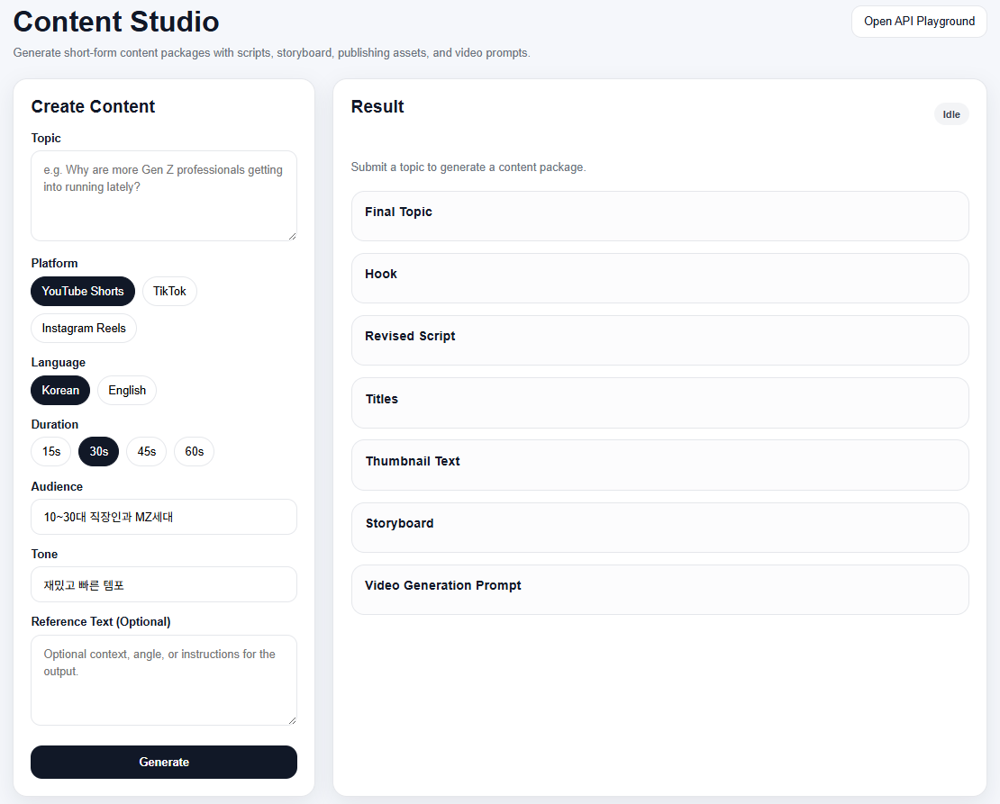

# Content Studio

> **AI Multi-Agent System for Short-Form Video Production**  
> **숏폼 영상 제작을 위한 AI 멀티 에이전트 자동화 시스템**  

> Generate **production-ready short-form video packages** through an AI multi-agent pipeline.  
> 단순한 주제 입력만으로 **스크립트, 스토리보드, 영상 생성 프롬프트**를 포함한 제작 준비 완료 패키지를 생성합니다.  

---

## Demo | 데모

**Demo Video** [Youtube](https://www.youtube.com/watch?v=K-E62674dWo)  

**Live Demo** [Link](https://content-studio-v1-910630079560.asia-northeast3.run.app/studio)  
*Note: The live demo is deployed on Google Cloud Run.*  

---

## Project Overview | 프로젝트 소개  

**Content Studio** is an AI-powered production pipeline that automates the early stages of short-form video creation. Instead of manually drafting scripts, planning visuals, and assembling publishing assets, the system generates a **complete content package** from a single structured input.  

Content Studio는 숏폼 영상 제작의 초기 단계를 자동화하는 AI 기반 생산 파이프라인입니다. 사용자가 주제와 조건을 입력하면 시스템은 스크립트 작성, 기획, 관련 자료 수집을 거쳐 **완성된 콘텐츠 패키지**를 생성합니다.  


The system is designed as a **multi-agent workflow** orchestrated with **LangGraph** and deployed as a cloud service on **Google Cloud Platform**, with an emphasis on cost efficiency and scalability.  

Content Studio는 **LangGraph 기반 멀티 에이전트 오케스트레이션**을 활용해 복잡한 생성형 AI 워크플로우를 구성했으며, **Google Cloud Platform** 상에 배포하여 비용 효율성과 확장성을 동시에 고려했습니다.  


### Pipeline Process | 처리 과정  

`User Input → Director → Research → Multi Script Writers → QA Selection → Revision → Storyboard → Title & Thumbnail → Music → Packaging`

**This project demonstrates:**  
- **LLM Multi-agent Orchestration**  
  Managing specialized AI agents through LangGraph in a structured workflow    
  (LangGraph를 활용한 멀티 에이전트 구조 설계)  
- **AI Content Pipeline Design**   
  Building a reusable pipeline that produces high-quality short-form content packages from minimal user input    
  (최소 입력만으로 고품질 숏폼 콘텐츠 패키지를 생성하는 파이프라인 설계)  
- **End-to-End AI Product Deployment**   
  Deploying a serverless, containerized AI application on Google Cloud Run     
  (Google Cloud Run 기반 서버리스 AI 제품 배포)    

---

## System Architecture & Tech Stack | 아키텍처 및 기술 스택  

### Cloud Infrastructure (GCP)
- **Compute: Google Cloud Run**  
  Adopted a serverless architecture with **scale-to-zero** to optimize cost and operational efficiency for bursty agent workflow traffic  
  에이전트 워크플로우 특성상 비정기적인 요청 패턴에 대응하기 위해 **scale-to-zero**가 가능한 서버리스 아키텍처를 채택  

- **Container Management: Docker & Google Artifact Registry**  
  Containerized the application for environment consistency and managed deployment images via Artifact Registry   
  애플리케이션을 컨테이너화하여 실행 환경의 일관성을 확보하고, Artifact Registry를 통해 이미지를 관리   

- **Region**: `asia-northeast3 (Seoul)` 
  Deployment in the local region to reduce latency      
  지연 시간 최적화를 위해 국내 region에 배포    


### AI & Software Stack
- **AI / LLM**: Anthropic Claude 3.5 Sonnet, Claude 3.5 Haiku  
- **Agent Orchestration**: LangGraph, LangChain Core  
- **Backend**: FastAPI, Pydantic, Python 3.11  
- **Deployment**: Docker, Google Cloud Run, Artifact Registry  

---

## System Interface | 시스템 인터페이스 

### Dashboard: Create Section

<p align="center">
  
</p>

Users provide a topic, target audience, tone, and optional reference text, then choose the platform, language, and duration. The Director agent routes the request and coordinates downstream agents.  

사용자는 주제, 목표 청자, 톤, 그리고 선택적으로 참고 텍스트를 입력한 뒤, 플랫폼, 언어, 영상 길이를 선택합니다. 이후 Director 에이전트가 요청을 해석하고 하위 에이전트들의 실행 흐름을 조정합니다.    

---

### Dashboard: Result Section

<p align="center">
  
</p>

The result section provides a full production package including:  
- final topic suggestion  
- revised script  
- scene-by-scene storyboard  
- publishing assets such as titles and thumbnail text  
- music direction  
- a final video generation prompt ready for downstream tools  


결과 화면에서는 다음과 같은 제작 패키지를 제공합니다:  
- 최종 주제 제안  
- 수정된 최종 스크립트  
- 장면별 스토리보드  
- 제목 및 썸네일 문구 등 발행 에셋  
- 배경음악 방향성  
- 영상 생성 툴에 바로 입력 가능한 최종 프롬프트  

---

## Multi-Agent Pipeline | 파이프라인

### Workflow

```
User Input
(topic, audience, tone, platform, language, duration, reference text)
        ↓
FastAPI API Layer
        ↓
LangGraph Multi-Agent Workflow
(Director → Research → Writers → QA → Revision → Storyboard → Assets → Music)
        ↓
Packaging Agent
        ↓
Production-Ready Content Package
```

---

### Key Agents | 주요 에이전트 역할  

- **Director Agent**  
  Interprets the request, extracts the core angle, and coordinates downstream agents.  
  사용자 요청을 해석하고 핵심 방향을 정의하며, 하위 에이전트 실행 흐름을 조정합니다.  
  Model: Claude 4.5 Haiku  

- **Research Agent**  
  Builds a lightweight research brief to improve factual framing and idea development for downstream writing agents.  
  후속 작성 에이전트들이 더 나은 맥락을 반영할 수 있도록 간단한 리서치 브리프를 생성합니다.  
  Model: Claude 4.5 Haiku  

- **Writer Agents (Fast / Story / Viral)**  
  Generate multiple script candidates with different narrative styles and retention strategies.  
  서로 다른 서사 스타일과 훅 전략을 가진 여러 개의 스크립트 후보를 생성합니다.  
  Model: Claude 4.5 Sonnet  

- **QA Selection Agent**
  Evaluates candidate scripts and selects the strongest one based on hook strength, pacing, clarity, and platform fit.  
  후보 스크립트를 평가하여 훅, 속도감, 명확성, 플랫폼 적합성을 기준으로 최적안을 선택합니다.  
  Model: Claude 4.5 Haiku  

- **Revision Agent**  
  Refines the selected script for pacing, clarity, and stronger CTA.  
  선택된 스크립트를 더 짧고 강하게 다듬고 CTA를 강화합니다.  
  Model: Claude 4.5 Sonnet  

- **Storyboard Agent**  
  Converts the final script into a structured scene plan with visuals, voiceover, and on-screen text.  
  최종 스크립트를 장면별 visual, voiceover, 자막 구조로 정리합니다.  

- **Title & Thumbnail Agent**  
  Generates titles, thumbnail text, captions, and hashtags optimized for short-form platforms.  
  숏폼 플랫폼에 맞는 제목, 썸네일 문구, 캡션, 해시태그를 생성합니다.  
  Model: Claude 4.5 Haiku   

- **Music Agent**  
  Suggests background music direction and audio editing guidance aligned with the emotional arc of the content.  
  콘텐츠의 감정선에 맞는 배경음악 방향성과 편집 가이드를 제안합니다.  
  Model: Claude 4.5 Haiku  

- **Packaging Agent**  
  Combines all outputs into a final editor brief and video generation prompt for tools such as InVideo, Runway, or CapCut.  
  전체 결과를 통합해 최종 에디터 브리프와 영상 생성 프롬프트를 구성합니다.  

---  

## Repository Structure | 프로젝트 구조

```
content-studio/
├─ app/
│  ├─ agents/
│  │  ├─ director_agent.py
│  │  ├─ research_agent.py
│  │  ├─ writer_fast_agent.py
│  │  ├─ writer_story_agent.py
│  │  ├─ writer_viral_agent.py
│  │  ├─ script_agent.py
│  │  ├─ qa_agent.py
│  │  ├─ revision_agent.py
│  │  ├─ storyboard_agent.py
│  │  ├─ title_thumbnail_agent.py
│  │  ├─ music_agent.py
│  │  ├─ packaging_agent.py
│  │  └─ router.py
│  ├─ api/
│  │  └─ routes.py
│  ├─ graph/
│  │  └─ workflow.py
│  ├─ schemas/
│  │  ├─ api_models.py
│  │  ├─ error.py
│  │  ├─ request.py
│  │  ├─ response.py
│  │  └─ state.py
│  ├─ services/
│  │  ├─ json_utils.py
│  │  ├─ korean_text_utils.py
│  │  ├─ language_utils.py
│  │  └─ llm_client.py
│  ├─ static/
│  │  ├─ studio.css
│  │  └─ studio.js
│  └─ templates/
│     └─ studio.html
├─ assets/
│  └─ images/
├─ main.py
├─ pyproject.toml
├─ Dockerfile
└─ README.md
```

---

## Environment Setup | 실행 방법

```bash
pip install --upgrade pip
pip install poetry

poetry install --no-root
poetry run uvicorn main:app
```

---

## Future Improvements | 향후 개선 방향

- stronger storyboard grounding  
- editor prompt polishing layer  
- richer platform-specific optimization  
- user history / personalization  
- evaluation pipeline for output quality  

---

## Version History | 버전 업데이트

### v2.0 — Multi-Agent Pipeline Expansion (2026-03-15)

**Major architecture update**

This version expands the system into a more structured multi-agent production pipeline and improves output quality by introducing additional specialist agents.  

**Key Updates**

- **Research Agent Added**
  - Introduces lightweight topic research before script generation  
  - Helps writers produce more context-aware scripts  

- **Director Agent Upgrade**
  - Improved request interpretation  
  - More structured creative brief generation  
  - Better coordination of downstream agents  

- **Music Agent Added**
  - Generates background music direction and audio cues  
  - Integrated into the final video generation prompt  
  - Designed for compatibility with video generation tools (InVideo, CapCut, Runway)  

- **Packaging Agent Improved**
  - Consolidates all outputs into a production-ready video generation prompt  
  - Includes:  
    - script  
    - storyboard  
    - thumbnail text  
    - titles  
    - captions  
    - music direction  

### v1.0 — Initial Prototype (2026-03-13)

Initial release of the Content Studio pipeline.  

**Core Features**

- Multi-script generation (Fast / Story / Viral)  
- QA-based script selection  
- Script revision agent  
- Storyboard generation  
- Title and thumbnail creation  
- Packaging into a video generation prompt  
- Deployment on Google Cloud Run  

---

## Author

**Hojin Son**
[GitHub](https://github.com/snhzyn)


