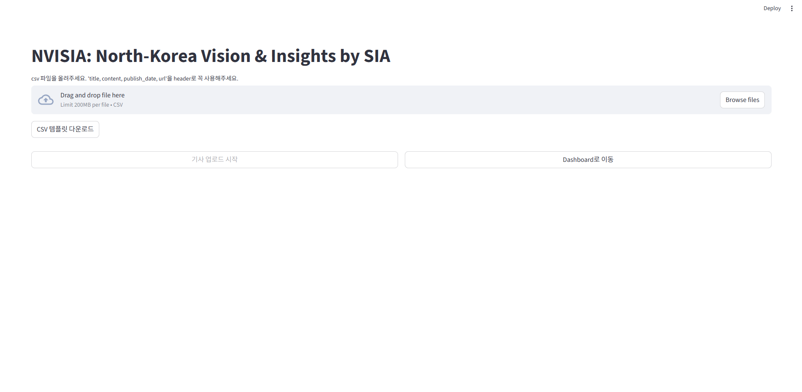

# PROJECT NVISIA  
## North Korea Visual Insight with SIA

> **End-to-End AI Product for North Korea News Intelligence**  
> Developed as part of ModuLabs Aiffel Data Scientist Bootcamp
> In collaboration with **SI Analytics** (https://si-analytics.ai/)

---

### 프로젝트 소개 (Project Overview)

<p align="center">
  
</p>  

> **Home 화면**: CSV 파일의 뉴스 데이터를 업로드하여  
> ETL → LLM 요약 및 키워드 추출 → ML 카테고리 분류 → DB ingestion → Dashboard 시각화 까지 한 번에 진행  

<p align="center">
  
</p>  

> **Dashboard**: 뉴스 카테고리 분포, Knowledge Graph,  
> 추천 기사, 전체 기사 목록, 지도 기반 시각화를 통합 제공  

**NVISIA**는 북한 관련 뉴스를 자동으로 수집·분석·시각화하는    
End-to-End AI 기반 뉴스 인텔리전스 플랫폼입니다.  

CSV 업로드 또는 웹 크롤링된 뉴스 데이터를 입력으로 받아   
ETL → LLM 요약 및 정보 추출 → ML 분류 → 데이터베이스 저장 →  
Streamlit 대시보드 시각화까지 전 과정을 하나의 시스템으로 제공합니다.   

본 프로젝트는 연구자, 정책 분석가, 기업 실무자 등이    
북한 동향을 직관적이고 구조적으로 탐색할 수 있도록 설계되었습니다.   

팀의 개발 과정, 실험 로그, 이슈 관리 내역은 아래 GitHub 저장소에 정리되어 있습니다.  
> https://github.com/milkpotato1000/project_NVISIA

---

### 주요 기능 (Key Features)  

- **Automated Data Pipeline**: 뉴스 크롤링 및 CSV 기반 데이터 수집, ETL 자동화  
- **LLM-based Enrichment**: 기사 요약, 인물·기관·지명·키워드 추출  
- **Database & Vector Search**: PostgreSQL + pgvector + PostGIS 기반 데이터 저장 및 검색  
- **Recommendation System**: 요약·키워드 임베딩 기반 콘텐츠 추천  
- **Geospatial Analytics**: 북한 행정구역 정규화 및 지도 기반 시각화  
- **Interactive Dashboard**: 뉴스 탐색, 추천, Knowledge Graph 제공 (Streamlit)  

---

### 기술 스택 (Tech Stack)  

#### **Backend & LLM**  
*   Python 3.12  
*   OpenAI API (summarization, embeddings)  
*   Scikit-Learn (SVM, TF-IDF)  
*   BeautifulSoup, psycopg2  
*   PostgreSQL (pgvector, PostGIS)  

#### **Frontend & Visualization**  
*   Streamlit  
*   Folium / Streamlit-Folium   
*   Pyvis / NetworkX  
*   Matplotlib  

#### **DevOps & Tools**  
*   Poetry  
*   Git  

---

### Repository Structure

```
project-NVISIA/
 ├─ src/              # python source files
 ├─ models/           # ML models and vectorizers
 ├─ data/             # csv files, templates, assets
 ├─ crawling/         # news crawling pipeline
 ├─ main.py           # entry point
 ├─ pyproject.toml    # poetry requirements
 ├─ .gitignore
 └─ README.md
```

---

### 실행 방법 (Environment Setup)  

```bash
# poetry 
pip install --upgrade pip
pip install poetry
poetry install --no-root
poetry run python main.py

# docker(env 값 입력해주세요)
cp .env.docker.example .env.docker
docker compose build
docker compose up
```

상세한 실행 방법은 [링크](https://github.com/milkpotato1000/NVISIA)를 통해 확인 할 수 있습니다.  

---

### System Architecture

```
User-provided CSV (news articles)
(test input: News Crawling via BeautifulSoup)
        ↓
Data cleaning & ETL
        ↓
LLM / ML enrichment
 ├─ Summary & Keywords extraction (model: gpt-4o-mini)
 ├─ Category classification (SVC)
 └─ Text embedding generation (model: text-embedding-ada-002)
        ↓
Postgresql data store
 ├─ Enriched articles
 │   ├─ summary
 │   ├─ keywords
 │   ├─ category
 │   ├─ event date / person / org / loc 
 │   ├─ title
 │   ├─ url, publish_date
 │   └─ embedding (pgvector)
 ├─ nk_org (North Korea essential organization geodata, EPSG:5179)
 └─ geojson (geospatial data, EPSG:4326)
        ↓
Analytics & Retrieval Layer (Query-time)
 ├─ Similarity-based recommendation
 ├─ Knowledge graph construction (TF-IDF / NetworkX)
 └─ Spatial queries: join nk_org & geojson (postgis)
        ↓
Streamlit Dashboard
 ├─ News table & filters
 ├─ Charts
 ├─ Interactive map (folium)
 ├─ Recommended articles
 └─ Knowledge graph visualization
```

---

### 프로젝트 정보 (Project Info)

- **기간(Period)**: 2025.11.17 ~ 2026.01.06 (In Progress)

- **Contributors**
*  손호진: 추천 시스템 디벨롭, Database 구축 및 운영(DBA), App-DB 데이터 인터랙션 관리, 지리 정보 시각화(Geospatial Visualization), 파일 업로더 구현  
*  천승우: Project Manager (PM), LLM 기반 기사 요약 파이프라인(Summarization Pipeline) 구축, Streamlit 대시보드 아키텍처 및 레이아웃  
*  정소민: 도메인(북한) 기반 데이터 검증 및 평가(Domain Validation), 사용자 경험(UX) 관점의 추천 시스템 평가  
*  진용현: 뉴스 분류 모델(Classification Model) 학습 및 성능 평가, Knowledge Graph 레이아웃 및 시각화 구현