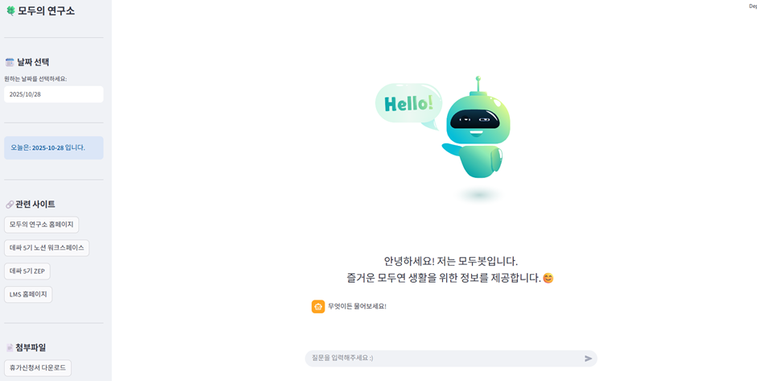

# ModuBot
## Langchain-based RAG Chatbot

> **Document Retrieval & Question Answering Chatbot**
> Developed as part of ModuLabs Data Scientist Bootcamp  

---

### 프로젝트 소개 (Project Overview)

<p align="center">
  
</p>  

> **Modubot**: 필요한 서류들을 좌측 바에서 다운 받을 수 있으며,  
> 중앙 하단의 채팅바를 통해 챗봇과 바로 채팅이 가능.  

**ModuBot**은 모두의연구소(Aiffel) 내부 문서를 기반으로  
학생들이 필요한 정보를 자연어 질의응답 방식으로 검색할 수 있도록 설계된  
**RAG(Retrieval-Augmented Generation) 기반 챗봇**입니다.  

PDF·문서 데이터를 임베딩하여 벡터 스토어에 저장하고,  
사용자 질문에 대해 관련 문서를 검색한 뒤 LLM을 통해 응답을 생성합니다.  

---

### 주요 기능 (Key Features)  

- LangChain 기반 RAG(Retrieval-Augmented Generation) 파이프라인  
- 문서 임베딩 및 유사도 기반 검색  
- LLM(OpenAI)을 활용한 질의응답 생성  
- Cohere 기반 문서 reranking  
- Streamlit 기반 챗봇 UI  

---

### 기술 스택 (Tech Stack) 

#### **Backend & LLM**  
*   Python 3.12  
*   LangChain 0.3.27  
*   OpenAI  
  ** text-embedding-3-large  
  ** gpt-4o-mini  
*   Cohere (Document Reranking)  

#### **Frontend**  
*   Streamlit  

#### **Tools**  
*   Poetry  
*   Git  

---

### Repository Structure  

```
chatbot/
 ├─ aiffel_chatbot.py      # main chatbot application  
 ├─ aiffel_chatbot.pdf     # project description & design  
 ├─ data/                  # document assets  
 ├─ pyproject.toml         # poetry requirements  
 └─ README.md
```

--- 

### 실행 방법 (Environment Setup)  

```Bash
pip install --upgrade pip
pip install poetry
poetry install --no-root    
poetry run streamlit run aiffel_chatbot.py
```

---

### Contributors  

- 손호진  
- 추영재  
- 정소민  
- 김순호  