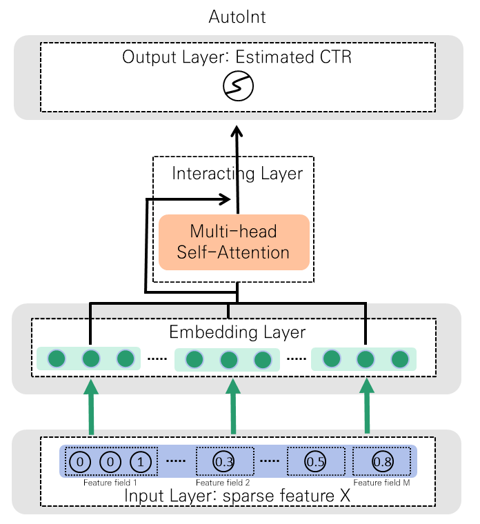
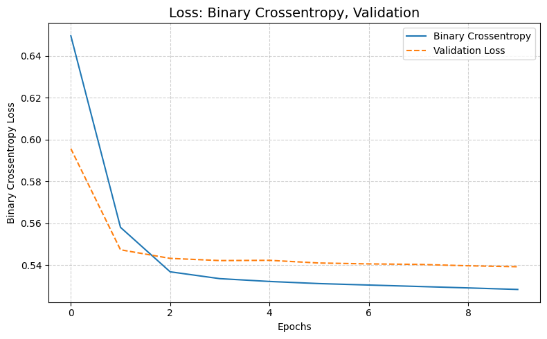
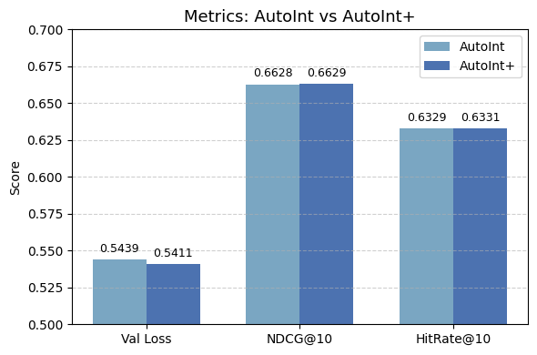

### **AutoInt 기반 MovieLens 추천 시스템**

본 프로젝트는 모두의연구소 데이터싸이언티스트 5기 과정 중 수행한 추천 시스템 구축 프로젝트입니다.  
MovieLens-1M 데이터셋을 기반으로 `AutoInt(Automatic Feature Interaction Learning)` 및 `AutoInt+` 모델을 구현하였고, streamlit을 통해 시각화하였습니다.  

AutoInt 논문에 게재된 [github](https://github.com/DeepGraphLearning/RecommenderSystems/blob/master/featureRec/autoint/model.py) 코드를 참고하여 간소화하였습니다.  

---

**모델 개요**  

AutoInt는 Self-Attention 메커니즘을 이용해 feature 간의 상호작용을 자동으로 학습하는 모델입니다.  

<p align="center">
  
  <br>
  <em>Autoint</em>
</p>

AutoIntMLP(AutoInt+)는 기존 AutoInt 모델에 MLP(Multi Layer Perceptron) 블록을 병렬적으로 결합한 모델입니다. 동일한 논문에서 제안되었으며, Attention 메커니즘에 DNN 기반의 학습을 동시에 진행하여 모델의 성능을 개선하였습니다.  

<p align="center">
  
  <br>
  <em>AutointMLP</em>
</p>

---  

**Requirements**

- python==3.9.7  
- tensorflow-cpu==2.6.0  
- numpy==1.19.5   
- pandas==1.3.3  
- scikit-learn==0.24.2   
- tqdm==4.62.3  

상세 내용은 `pyproject.toml` 통해 확인할 수 있으며, poetry를 통해 편리하게 설치 가능합니다.  

```Bash
pip install --upgrade pip
pip install poetry
poetry install --no-root    
poetry run jupyter notebook # VSCode: Python Interpreter로 변경
```

---  

**실험 환경**

| 항목 | 값 |
|------|----|
| 데이터셋 | MovieLens 1M |
| Optimizer | Adam (lr = 1e-4) |
| Loss | Binary Crossentropy |
| Batch Size | 2048 |
| Metric | NDCG@10, HitRate@10 |  
| Learning Rate | 1e-4 |


**실험 결과**

| Run | Dropout | Epochs | Embed Dim | Attention Heads Num | DNN Batch Norm | Entropy Loss | Val Loss | NDCG@10 | HitRate@10 |
|:--:|:--:|:--:|:--:|:--:|:--:|:--:|:--:|:--:|:--:|
| **Run 1** | 0.4 | 5 | 16 | 2 | F | 0.5349 | 0.5439 | 0.6628 | 0.6329 |
| **Run 2** | 0.2 | 10 | 16 | 2 | F | 0.5299 | 0.5414 | 0.6628 | 0.6329 |
| **Run 3** | 0.2 | 10 | 24 | 4 | F | 0.5272 | 0.5411 | 0.6629 | 0.6331 |
| **Run 4** | 0.2 | 10 | 24 | 4 | T | **0.5284** | **0.5392** | **0.6627** | **0.6330** |  

---

**결과 분석**  

Binary Crossentropy Loss, Validation Loss 는 위 Run 동안 모두 안정적으로 감소하였습니다. 파라미터 조정 뒤에도 크게 변화가 없어 실험은 Run4에서 종료하였습니다. 향후 DNN Layer를 늘리거나, Attention Heads Num을 늘려보는 방법을 시도해볼 수 있겠습니다.  

<p align="center">
  
  <br>
  <em>Train / Validation Loss</em>
</p>

---

**AutoInt vs AutoInt+**

AutoInt+는 AutoInt 보다 미세하나 성능이 개선되었습니다. 작은 AUC의 개선이 CTR에 상당한 상승을 가져왔다는 [Cheng et al., 2016] 선행 연구가 말해주듯이, 소폭의 성능 개선도 유의미한 성과라고 할 수 있겠습니다.  

<p align="center">
  
  <br>
  <em>metrics: Autoint vs Autoint+</em>
</p>

---

**폴더 구조**  

폴더의 구조는 다음과 같습니다.  

```
MovieLens-1M(Autoint)
	│
autoint
	│  autoint.py
	│  show_st.py
	│  README.md
	│  poetry.lock	
	│  pyproject.toml	
	│
	├─ data
	│    │  field_dims.npy
	│    │  label_encoders.pkl
	│    │
	│    └─ ml-1m
	│         │  movies_prepro.csv
	│         │  ratings_prepro.csv
	│         │  users_prepro.csv
	│         │
	│         ├─ raw
	│         │   │  movies.dat
	│         │   │  ratings.dat
	│         │   │  users.dat
	│         │   └─ README.md
	│         │
	│		  └─ image
	│
	│
	├─ model
	│    │  autoInt_model_weights.h5
	│ 
    ├─ notebooks
	│      │  eda.ipynb
	│      │  prepro.ipynb
	│      │  autoint.ipynb
	│      │  autointMLP.ipynb
	│
	└─ __pycache__
	      autoint.cpython-311.pyc
	      show_st.cpython-311.pyc
```

---

**참고 문헌**  

- "AutoInt: Automatic Feature Interaction Learning via Self-Attentive Neural Networks" (Shi et al., 2019)  
- MovieLens 1M Dataset: [link](https://grouplens.org/datasets/movielens/1m)  
- “DeepFM: A Factorization-Machine based Neural Network for CTR Prediction” (Guo et al., 2017)  